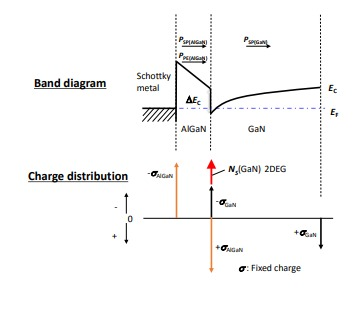

@import "../local.less"

## Basic Device Structure
Electrons are considered to be transffered from the doped 
AlGaAs barrier to undoped GaAs. At the heterointerface. a tringular quantum well is formed. 

## GaN-Based FET
 AlGaN/GaN HEMTs usually shows the normally on characteristic. This means the negative threshold voltage.<a id="image1">Fig1</a> 
 threshold voltage $V_t$ is described as follows

 $$\begin{equation}
    \begin{aligned}
    V_T &=\phi_b-\Delta E_c -V_{\text{AlGaN}}\\
        &=\phi_b-\Delta E_c-\frac{qN_s d_{\text{AlGaN}}}{\epsilon_0\epsilon_{\text{AlGaN}}}
    \end{aligned}
  \end{equation}$$

 where $\phi_b$,$\Delta E_c$,$N_s$ $d_\text{AlGaN}$ $\epsilon_{\text{AlGaN}}$ and $q$ indicate Schottky barrier height, conduction band offset between GaN and AlGaN,2 DEG density, AlGaN thickness,relative dielectric constant(比誘電率) of AlGaN,and an electron charge,respectively.

    
    グラフェンC1s内殻準位光電子のスペクトル

> [Power GaN Devices Materials,Applications and Reliability](https://opac.library.tohoku.ac.jp/opac/opac_details/?reqCode=fromlist&lang=0&amode=11&bibid=TT22058248&opkey=B165235765930896&start=1&totalnum=2&listnum=0&place=&list_disp=20&list_sort=6&cmode=0&chk_st=0&check=00)

## Surface-Related Trapping 
 one of the key issues affecting the dynamic properties of the GaN HEMT is the charge trapping related to surface states. <em id="imp">During high-field off-state conditions,parasitic electrons could be injected from the gate metal to the epitaxial surface</em>,where they are readily available to be trapped at surface states. Surface states include <em id="que">donor-like states</em> required for the formation of the 2DEG at the AlGaN/GaN interface.[ref](https://doi.org/10.1063/1.126940) If negative charge is trapped at the surface,the surface potential decreases and the ungated region depletes,suppressing the 2DEG carrier concentration and promoting current collapse.Discoverd in the early 2000s,[[ref1](https://doi.org/10.1109/16.906437).[ref2](https://doi.org/10.1109/16.906451)  [ref3](https://d1wqtxts1xzle7.cloudfront.net/47472373/ted.2004.83502520160724-8148-1eifxqy-with-cover-page-v2.pdf?Expires=1652433936&Signature=AjCEwLOzTrPyHkDDBAj50-Aqm8kYRZDBsS09oK6ljGKGQP56gb8r~FBtYrTlrk93mcDplvmQmS8zf01AyfoNIplxYMiQQI8HS3xSZQGT0HSHzZsfbVt~D21QoGb9Z030Lqxg7zWIyf62B5biC5n5Cf4TT2VoSIBqhBejxNcoYuvl7MWk95dYSdrBR9Xa5fge6Fo4-v5Vy0IIKGHdYEYygNg~~4FugplMFeXBRK5qieRA8DRPAwvlNjlIUqeeM16na6CWGLkEiduwfKIUllc3~psEqtiBrQFV3J4LNhonNj3TJPxHLctYbJzK1irUD9zbXS-3hdcFn4ixbOBsNO-rHA__&Key-Pair-Id=APKAJLOHF5GGSLRBV4ZA)]this phenomenon was historically referred to as 'virtual gate'.[ref](https://doi.org/10.1109/16.906451) An effective solution to drastically mitigate the surface-related current collapse is the introduction of passivation layer(usually silicon nitride) on top of the ungated access regions.
## Impact of Electrical Stress on Trapping Mechanisms
 The impact of a dc stress on the variation of trapping mechanisms in devices witha different iron doping buffer compensation was studied in detail.[1](https://doi.org/10.1109/IRPS.2014.6861113)
 [Meneghini et al.](https://doi.org/10.1109/IRPS.2014.6861113) clarified the influence of negative bias dc stress on the leakage current and of increase of the trapping mechanisms in devices with a different iron doping compensation. The reverse bias stress induces a significant worsening of both the staic and dynamic perfomance of device, represented by a significant increase in the dc leakage current and in the current collapse,re
