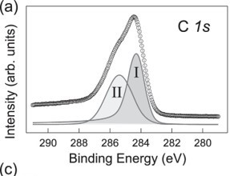
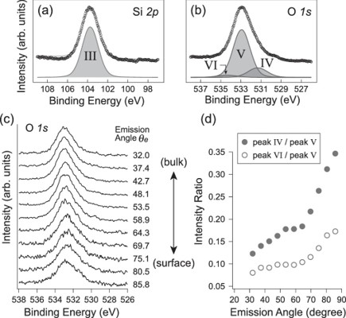

<link rel="stylesheet" href="style.css">
# X線光電子分光の基礎

## X線光電子分光法の原理

### (1)光電子放出過程

XPSではX線照射にともない固体表面から放出された光電子の運動エネルギー$ E^{'}_k$を測定することにより，光電子放出過程におけるN電子系の基底状態(始状態)から(N-1)電子系の励起状態(終状態)への遷移に伴うエネルギー変化を観察する．

ここで固体中での光電子の運動エネルギーを$E_k$，光エネルギーを$hv$，始状態のエネルギーを$E_i(N)$,終状態のエネルギーを$E_f(N-1)$とすると，エネルギー保存から次の式が成り立つ
$$E_i(N)+hv=E_k+E_f(N-1)$$ (1)

ハートリーフォック近似において，光電子が無限遠方に取り去られるとき1電子波動関数は不変であるとかていすると，電子の占有軌道の結合エネルギー$E_B$が次式で与えられる．(クープマンの定理)
$$E_i(N)-E_f(N-1)=-E_B$$(2)

ここで，$E_B$はフェルミ準位からのあたいなので，個体表面から飛び出した光電子の$E^{'}_k$
と仕事関数を用いて$W$を用いて，次のようになる．
$$E_B=hv-E^{'}_k-W$$(3)

光電子分光法では試料に照射するX線のhvは基地であり，$W$を構成すると，$E^{'}_k$を測定することにより，着目した電子軌道の$E_B$が決定できる．$E_B$は原子核と電子のクーロン力，電子管のクーロン反発力と交換相互作用で支配され，原子番号だけではなく，軌道にもつよく依存して変化するが，元素に固有の値である．

#### A.光励起過程

図2.1.2にTi(0001)1×1表面の光電子スペクトルを示す．孤立したTi原子は電子軌道を22個の電子が占有し，金属結合に関与しない内殻準位の$E_B$は4966 eV(1s),563.7eV(2s),$461.4eV(2p_{1/2})$,$455.5 eV(2p_{3/2})$,60.3(3s),34.6(3p)である．Ti(0001)1×1表面の$W$は4.7 eVである．運動エネルギー表示においてhvを661.4eVから1551.3eVに変化させたとき，運動エネルギーひょうじにおいて$hv$を661.4eVから1551.3 eVに変化したとき，$E_k=300～500 eV$付近の構造はピーク位置がまったく変化しない．これはTi LMMオージェ電子によるもので，ある．LMMオージ電子のエネルギーは
$$E^{'}(LMM)=\left[ E_B(L)-E_B(M) \right]-E_B(M)-W$$(4)
光電子とオージェ電子を識別する方法として，hvを変化することが有効である．

光電子の励起が真空準位いかのときにはでんしは表面から放出されないが，光伝導減少や太陽電池などにりようされる(内部光電効果)，これに対して，真空順位以上の非占有軌道にれいきされるお固体表面から脱出可能となり，外部光電効果と呼ばれる．

#### B.固体内での移動過程
(1)非弾性散乱

固体内での移動過程は光電子の非弾性散乱と弾性散乱により支配されている．光電子が固体中をいどうすると非弾性散乱によりそのピーク強度がげんしょうし，エネルギー損失した光電子は次々と非弾性散乱をを繰り返してそのぴーくはバックグラウンドに埋もれてしまう．固体内での日弾性散乱が東方的におきるとき，光電子強度の減少$\Delta I$は光電子強度Iと移動距離$\Delta x$にひれいするので，次の式が得られる．
$$I=I_0\exp{\left(-\frac{x}{\lambda}\right)}$$(5)
ここで，減衰係数$\lambda$は非弾性平均自由航行とよばれ，非弾性散乱を生じるまでに光電子が移動できる平均的な距離である．式(5)より，距離$\lambda$を移動したとき，光電子強度は1/eとなり著しく減少する．

# X線光電子分光イメージング
## B.グラフェンFETデバイスにおけるグラフェン/電極金属界面の電荷移動領域の直接観測

グラフェンは，厚みがわずか1原子層の炭素からなる安定な二次元系物質であり，その高い電子移動度や特異な電子物性などから，次世代のデバイス材料として注目がたかまっており，さまざまなアプローチからの物性制御が試みられている．特にグラフェンFETは，現在のシリコンデバイスを凌駕する超高速動作が期待されているが，いまだに十分な特性がえられてない．その原因の一つとして考えられているのがグラフェンと電極金属界面の電荷移動によって生じるぽ転借障壁の形成である．これを明らかにするためには，このような接合界面の電子状態や化学結合状態，構造などの情報をナノスケールで行うことが大切である．

そこでこのグラフェンFETデバイスにおけるグラフェン/電極金属界面に対して，三次元ナノXPSによる局所的な化学結合状態やポテンシャル分布の直接観測を行った．測定資料はp+-Si(100)基板を酸素プラズマ処理したSiO2薄膜上に単層剥離グラフェンを転写し，その上にNi電極を蒸着したものである．図1に，グラフェン上のC 1s内殻準位光電子スペクトルを示す．このようなFETデバイスでは電極を作成するためのリングラフィー加工時に表面にレジストをするため，表面の炭素汚染は避けられず，C1s光電子スペクトルピークに関する詳細な解析は困難であるが，三次元ナノXPSでは検出角度の異なるスペクトルが大量に得られるため，これらを表面感度の差のみを考慮して同一パラメータでフィッティングすることにより，非常に高い精度でスペクトルピーク分離を行うことが可能である．実際にピーク分離により得られたピークⅠとピークⅡが表面成分であることがわかり，グラフェン成分（ピークⅠ)と表面汚染成分(ピークⅡ)が正確に分離されていることがわかる．
 このようにして決定したC 1s内殻準位のグラフェン成分について，電極界面近傍における結合エネルギーの面内分析を行った同一グラフェン内におけるピークシフトは化学ポテンシャルのしふとによるものであると考えられ，グラフェン/金属界面の電荷移動により界面近傍のグラフェンにホールがドープされていることがわかる．
 グラフェン/金属海面における電荷移動領域がこのような長距離にわたることは，単純にグラフェンと電極金属の基礎物性を考えただけでは説明できなかった．そのため下地基盤の状態を調べるためO 1s 内殻准位スペクトルの解析を行った結果

    
    図1:グラフェンC1s内殻準位光電子のスペクトル

    
    図2:(a)Si 2p軌道(b)O1の内殻順位のスペクトル(c)様々な角度からスペクトル(d)Vpeakを基準にほかのピークの比較

ピークVIについては，検出角度依存性から，その深さの方向の位置が基板より表面側かつ表面汚染物より内部側ということから，SiO2に表面あるいわ，酸素プラズマ処理SiO2が親水性になっていることから，界面に水和水もしくはSi-OH結合が存在しており，それがグラフェンの誘電率に影響を与えていると考えられる．

