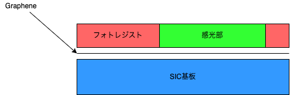

@import "../local.less"
# 単原子長ゲートによる低環境負荷物質からなる高出力THz増幅器の創出

## 1 SiC上のグラフェンの成長

### 1.1 SiC基板の洗浄
| 番号 |作業|  
|---|---|
|1|アセトンを入れたビーカーにSiCを入れ，10分洗浄   |  
|2|超純水で1分間超音波洗浄|
|3|エタノールで10分間超音波洗浄 |
|4|水を入れてかえて5分間つける|
|5|過酸化水素水をビーカーの線まで入れて，そこに硫酸を上の線まで入れる(**ピラニア溶液**)(1:1)これを二分間放置する|
|6|5番で作成した溶液に10分間漬ける|
|7|SiCを超純粋で3回すすぐ|
|8|超純粋で5分間超音波洗浄|
|9|超純水で5分間流水洗浄|
|10|HFに5分間漬ける|
|11|超純粋で5回すすぐ|

### 1.2 Graoheneの成膜
以下の図1になる

　

SiC基盤にGrapheneを成長させた時の図

* [RF炉の詳しい操作方法](RF炉%20使用方法.pdf)

## 2 AlignerMarkによるデバイス作成位置の決定
デバイスの作成位置をアライナマークにより決定する．

### 2.1 Photo_Litho
1.スピンコートによりフォトレジストを全体に塗布

　

スピンコートによりフォトレジストを塗布する

[詳しい装置の動かし方はこちらを参照](EB描画前のレジスト塗布.pdf)

2. 露光(基板上のフォトレジストにパターンを転写)

　

露光後

3. 現像(パターン部以外のフォトレジストを除去する作業)

　

現像処理

### 2.2 EB蒸着(Ni/Au)

真空中で電子銃から発生する電子ビームを蒸発材料に照射し，加熱・蒸発させ，基盤へ薄膜を形成する方法

　

EB蒸着後

[詳しい装置の動かし方はこちら参照](EB蒸着.pdf)

### 2.3 リフトオフ

フォトレジストを離脱させることによって，フォトレジスト上部に乗っている(Ni\Au)を除去する．

　

リフトオフ後

[詳しい装置の動かし方はこちらを参照](リフトオフ.pdf)

**基盤の様子**

　

 AlignerMark後(オレンジ色の部分がNi/Au)

## 3. Graphene Etching(RiE:反応性イオンエッチング)

基板上に存在している不要なGrapheneを除去する

### 3.1 Photo_Litho
フォトリソにより，Grapheneのエッチングする場所を決める

1. スピンコートによる塗布

　

スピンコートによりフォトレジストを塗布する

2. 露光

　

露光後

3.現像

　

現像後

### 3.2 RIE:反応性イオンエッジング

フォトレジストが乗っていない部分のグラフェンが除去される．

　

露光後

### 3.3 レジスト剥離

　

露光後

### 3.4 UV&Ozone(クリーニング)
**概要**
紫外線により発生したオゾンから分離した活性酸素が，有機汚染物質と化学的に結合し，二酸化炭素や水などの揮発性物質に分解反応させて除去する．一般的に有機物質の汚れに対して洗浄効果があり，無機物質の汚れに対しては洗浄効果がない

**グラフェン(サイズ)**

　

クリーニング後のデバイス毎のGrapheneの大きさ

## 4 AL成膜

### 4.1 Photo_Litho

1. スピンコートによる塗布

　

レジスト塗布後

2. 露光

　

露光後

3. 現像

　

露光後

### 4.2 EB蒸着

