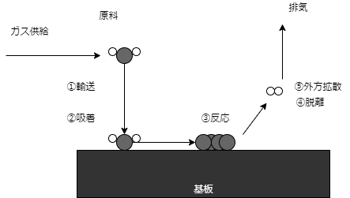

@import "../local.less"

# 半導体プロセス

## 基本的な半導体プロセスの流れ

### CVD

#### 表面反応

CVD法は原料がすを化学反応させ基盤ひゅめんにうすまくを形成する方法である．基板表面でのCVD反応を示したのが下の(1)になる．原料ガスが基板表面に輸送され，基板表面に吸着される．化学反応がおきて成膜の核が形成され，これを起点に薄膜が形成される．成膜反応で脱離した生成物は基板表面から外に拡散し，廃棄される．

　

表面反応

気体相の原料ガスから成膜反応を発生させるためには，活性化エネルギー$\epsilon$が必要となる．この$\epsilon$の与え方として，熱，電離と励起，光があり，それぞれ熱CVD,プラズマCVD,光CVDと呼ばれている．

