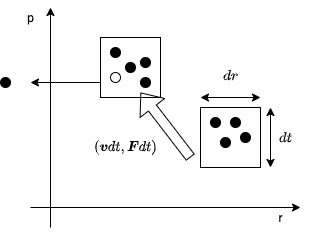

@import "../local.less"

## 半導体中の電子

## 電子・正孔
 電子はフェルミオンで1つの状態を1個の電子が占有し，その温度$T$での分布は __フェルミ分布関数__ 以下のようになる
$$\begin{equation}
  f_E(E)=\frac{1}{\exp{[(E-E_F)/k_BT]+1}}
\end{equation}$$
で表せる．$E_F$はフェルミエネルギー,$k_B$はボルツマン定数である．$T=0$では$E_F$までのすべての状態を電子が占め，$E>E_F$ではすべての状態が空である．$E_F$が許容帯中にあり，$E_F$のところに状態密度がある場合，$k$空間内で$E(k)=E_F$となる面をフェルミ面，対応する波数$k_F$をフェルミ波数とよぶ．自由電子系の場合，フェルミ面は球面になる．
フェルミ面が存在する系に電場がかかると，電子は加速され，__電子の運動量分布の偏り__ (ドリフト電流)が生じて電流となる.このように，固体中を移動して電荷を運ぶことのできるものを一般に __電荷キャリア__ と呼ばれている．半導体，絶縁体に分類される物質は$E_F$が禁制帯中に存在し絶対零度，低電場では運動量分布に偏りが生じないため，電気伝導が起こらない．
 荷電子帯が詰まった状態に対して，何らかの原因で結晶波数$k$の1電子状態が空いたとすると，この係を流れる電流は$\boldsymbol{J(k)}$は，

## 古典的電気伝導
### 輸送係数
　電気伝導は、外部からの電場を加えるなどの方法で疲弊どう状態が生じ、キャリアによって固体中を電流が流れる現象である。
　系の外部から与えられた摂動に対する応答が１次で扱える時、 __線形応答__ という。外部電場$\bold{\Epsilon}$に対して電流密度$\bold{j}$が生じる時、線形応答では
$$\begin{equation}
\boldsymbol{j=\sigma\Epsilon}\space\text{あるいは}\boldsymbol{\Epsilon=\rho j}
  \end{equation}$$

と表せる。ここで$\boldsymbol{\rho}$,$\boldsymbol{\sigma}$は __伝導率テンソル__, __低効率テンソル__,と呼ぶ。

### ボルツマン方程式
　柚香質量キャリアは、格子振動、不純物、他のキャリアなどによって散乱を受ける。散乱の間にするむ平均距離を, __平均自由行程__　という。古典的伝導において外部からの力や散乱による非平衡過程を統計的に扱う代表的方法が以下に示すボルツマン方程式によるものである。質点の力学状態は位置座標$\boldsymbol{r}$と運動量$\boldsymbol{p}$で指定される.そこで、$\boldsymbol{r}$と$\boldsymbol{p}$の6次元空間内の粒子系の分布関数$f(\boldsymbol{r},\boldsymbol{p},t)$を考える.$f$は点$(\boldsymbol{r},\boldsymbol{p})$の周辺の微分体積$d\boldsymbol{r}d\boldsymbol{p}$の中に時間$t$に存在する粒子の全体にする割合が$f(\boldsymbol{r},\boldsymbol{p},t)d\boldsymbol{r}d\boldsymbol{p}$であることを意味する。
 散乱がない場合には、粒子には働く力を$\boldsymbol{F}$として,古典力学的運動は、
 $$\begin{equation}   
 \frac{d\boldsymbol{r}}{dt}=\boldsymbol{v}=\frac{d\boldsymbol{p}}{dt},\space \frac{d\boldsymbol{p}}{dt}=\boldsymbol{F}
 \end{equation}$$
で与えらる。$d\boldsymbol{r}d\boldsymbol{t}$に含まれる粒子の力学的状態はほぼ同じであるから、
$$\begin{equation}
f\left(\boldsymbol{r}+\left( \frac{\boldsymbol{p}}{m^*}\right)dt,\boldsymbol{p}+\boldsymbol{F}dt,t+dt\right)=f(\boldsymbol{r},\boldsymbol{p},t)
\end{equation}$$
となる。散乱があると、Fig1に模式的に示したように、さまざまな理由による変化が生じるこれを$(\partial f/\partial t)_c$と表すと以下の式になる。
$$\begin{equation}
f\left(\boldsymbol{r}+\left( \frac{\boldsymbol{p}}{m^*}\right)dt,\boldsymbol{p}+\boldsymbol{F}dt,t+dt\right)+\left(\frac{\partial f}{\partial t}\right)=f(\boldsymbol{r},\boldsymbol{p},t)
\end{equation}$$

　

  
  位相空間中の微小堆積$d\boldsymbol{r}d\boldsymbol{t}$中の粒子がdt間の時間発展で移動し、散乱により入れ替わる様子を模式的に描いたもの

$f$を$dt$の1次の項まで展開すると
$$\begin{equation}
\frac{\partial f}{\partial t}+\frac{\boldsymbol{p}}{m^*}\cdot\frac{\partial f}{\partial \boldsymbol{r}}+\boldsymbol{F}\cdot \frac{\partial f}{\partial \boldsymbol{p}}=\left(\frac{\partial f}{\partial t}\right)
\end{equation}$$
が得られる。式(5)は __ボルツマン方程式__,右辺の散乱による$f$の変化項は __衝突項__ と呼ばれる.衝突項の最も簡単な矜持は定緩和時間近似であり、エネルギーに依存しない定数の緩和時間$\tau$を考え、
$$\begin{equation}
  \left(\frac{\partial f}{\partial t} \right)=-\frac{f-f_0}{\tau}
\end{equation}$$
とする。$f_0$は$\boldsymbol{F}=\boldsymbol{0}$の熱平衡での分布関数で、$\tau$は非平衡状態からの回復に要する時間ということになる。一様な系を考えると$\partial f/\partial\boldsymbol{r}=\boldsymbol{0}$より、
$$\begin{equation}
\frac{\partial f}{\partial t}+\boldsymbol{F}\cdot \frac{\partial f}{\partial \boldsymbol{p}}=-\frac{f-f_0}{\tau}
\end{equation}$$
式(6)の近似の下では、より一般的な緩和時間近似として$\tau$の運動量$\boldsymbol{p}$依存を考えるものがある。以下、$\boldsymbol{p}=h\boldsymbol{k}$や量子統計など量子論を半古典的に使用する。
$f$が位相空間内で何らかの偏りを持つことで、粒子系の流れが生じる。外部電場などの加速により分布関数$f(\boldsymbol{r},h\boldsymbol{k},t)$にk空間で偏りが生じることで実空間でキャリア全体の流れ(__ドリフト電流__)が生じるのに対し、実空間($\boldsymbol{r}$)での偏りによって生じるキャリア移動を __拡散電流__ と呼ぶ。

### ドリフト電流
　空間的に一様な電子系に一様電場$\boldsymbol{\Epsilon}$がかかった定常状態($\partial f/\partial t=0$)を考える。衝突項は残し,式(7)に$\boldsymbol{p}$に依存する緩和時間近似を適用すると、
$$\begin{equation}
  -e\boldsymbol{E}\cdot\frac{\partial f}{\partial\boldsymbol{p}}=-\frac{f-f_0}{\tau(\boldsymbol{p})}\space\therefore f(\boldsymbol{p})=f_0(\boldsymbol p)+e\tau(\boldsymbol{p})\boldsymbol{E}\cdot\frac{\partial f}{\partial\boldsymbol{p}}
\end{equation}$$
ここで$\boldsymbol{E}$を摂動と考えて,右辺第二項の$f$を$f_0$再度右辺に代入して$\boldsymbol{E}$の2次と逐次代入で$\boldsymbol{E}$のべき展開が得られる。一次では
$$\begin{equation}f(\boldsymbol{p})\simeq f_0(\boldsymbol{p})+e\tau(\boldsymbol{p})\boldsymbol{E}\cdot\left(\frac{\partial f_0}{\partial\boldsymbol{p}}\right)\end{equation}$$
